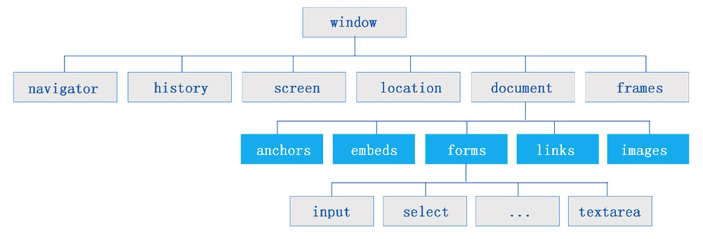
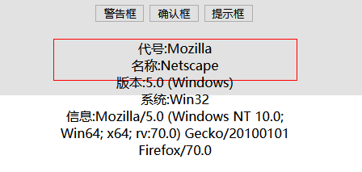
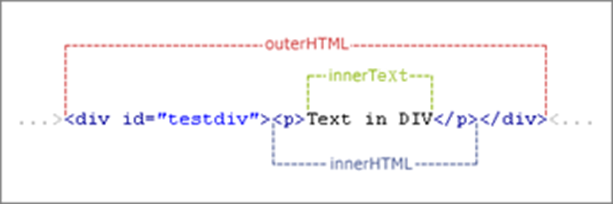

## JavaScript BOM 学习

BOM简单的说就是浏览器对象模型，对BOM的操作就是对浏览器的功能和属性的操作；

BOM的核心是`window`,它是一个浏览器的功能实例，浏览器会为HTML文档创建一个专属的window对象，并为每一个框架创建额外的window对象。
window对象是BOM的顶层，所有s其他对象都是通过window对象衍生的；但是在调用子对象的时候并不强制要求声明

DOM的`document`也是window的子对象之一；以下两种写法是相同的:

``` html
	window.document.getElementById("herd")
	document.getElementById("herd")
```

### window对象常用方法

#### 弹窗

`window.alert()`      消息框；弹窗会直接显示一段信息字段

`window.confirm()`  确认框；弹窗显示text字段的同时给出确认和取消两个按钮，返回true和false

`window.prompt()`    提示框；弹窗显示字段和一个输入框，并返回输入框内容

``` html
<!DOCTYPE html>
<html>
	<head>
		<meta charset="utf-8">
		<title></title>
	</head>
	<body>
		<input type="button" value="警告框" onclick="showalert()" />
		<input type="button" value="确认框" onclick="showconfirm()" />
		<input type="button" value="提示框" onclick="showprompt()" />
		<script>
			function showalert(){
				window.alert("这是一个警告框");
			}
			function showconfirm(){
				window.confirm("这是一个确认框");
			}
			function showprompt(){
				window.prompt("这是一个提示框");
			}
		</script>
	</body>
</html>

```

#### 浏览器窗口信息

`window.open()` 打开新窗口

``` html
window.open( url , name , features , replace )
```

> url：需要载入的网页URL地址
>
> name：为新窗口命名
>
> features：可选，窗体的特性定义
>
> | 属性        | 特性                 |
> | ----------- | -------------------- |
> | height      | 窗口高度             |
> | width       | 窗口宽度             |
> | left        | 左边距               |
> | top         | 左上边距             |
> | directories | 是否显示链接工具栏   |
> | location    | 是否显示地址栏       |
> | menubar     | 是否显示菜单栏       |
> | resizable   | 是否允许调整窗口尺寸 |
> | scrollbars  | 是否显示滚动条       |
> | status      | 是否显示状态栏       |
> | toolbar     | 是否显示工具栏       |
>
> 

`window.close()` 关闭当前实例化对象的窗口

`window.moveTo()` 移动当前窗口

`window.resizeBy()/resizeTo()` 调整窗口

`window.focus()` 获得当前对象窗口的焦点

`window.blur()` 释放当前对象窗口的焦点

`window.print()` 打印当前窗口或Frame

`window.scrollBy()/scrollTo()` 滚动当前窗口总的HTML文档

`setInterval()/clearInterval()` 设置定时器

`setTimeout()/clearTimeout()` 删除定时器

#### 浏览器窗口尺寸

- IE、Chrome、Firefox、Opera、Safan

  `window.innerHeight` 浏览器窗口的内部高度

  `window.innerWidth` 浏览器窗口的内部宽度

- IE8以下版本

  `document.documentElement.clientHeight` 高度

  `document.documentElement.clientWidth` 宽度

  `document.body.clientHeight` 高度

  `document.body.clientWidth` 宽度

**通常在JavaScript中，一段较为通用代码如下：**

``` javascript
var w = window.innerWidth || document.documentElement.clientWidth || document.body.clientWidth ;
var h = window.innerHeight || document.documentElement.clientHeight || document.body.clientHeight ; 
```

**窗口页面绝对居中**

``` javascript
// 页面绝对居中必须设置style属性： position:absolute;
var left = (w-width)/2;
var top = (h-height)/2;
// 利用margin外边距的top和left来“绝对居中”在浏览器中间
document.getElementById("cen").style.top =  top+"px";
document.getElementById("cen").style.left = lef
```

`navigator.appName` 返回浏览器名称

`navigator.appVersion` 返回浏览器版本号

`navigator.Platform` 返回浏览器操作系统

`userAgent` 返回包含内码名称、版本号；用于识别用户

``` javascript
<input type="button" value="浏览器信息" onclick="showversion()"/>
function showversion(){
	// navigator 浏览器信息
	var put = document.getElementById("version");
	put.innerHTML = "代号:"+navigator.appCodeName+"<br/>";
	put.innerHTML+= "名称:"+navigator.appName+"<br/>";
	put.innerHTML+= "版本:"+navigator.appVersion+"<br/>";
	put.innerHTML+= "系统:"+navigator.platform+"<br/>";
	put.innerHTML+= "信息:"+navigator.userAgent+"<br/>";				
}
```



#### 屏幕对象:screen

| 属性对象          | 特性                                   |
| ----------------- | -------------------------------------- |
| screen.height     | 回显屏幕高度                           |
| screen.width      | 回显屏幕宽度                           |
| screen.avaiHeight | 回显除任务栏的屏幕高度（可用的高度）   |
| screen.avaiWidth  | 回显除系统部件宽度的宽度（可用的深度） |
| screen.colorDepth | 浏览器分配的颜色或颜色深度             |
| screen.pixelDepth | 返回屏幕的颜色分辨率（色彩分辨率）     |

``` javascript
<input type="button" value="屏幕信息" onclick="showscreen()" />
function showscreen() {
    document.getElementById("screen").innerHTML = "屏幕尺寸:"+screen.height+"*"+screen.width+"<br/>";
	document.getElementById("screen").innerHTML+= "窗口尺寸:"+screen.availHeight+"*"+screen.availWidth+"<br/>";
	document.getElementById("screen").innerHTML+= "色彩深度:"+screen.colorDepth+"/色彩分辨率:"+screen.pixelDepth+"<br/>";
}
```

#### 地址对象:location

*地址对象整理的是当前的URL信息*

| 属性                        | 特性                                     |
| --------------------------- | ---------------------------------------- |
| location.href               | 整个URL字符串                            |
| location.protocol           | URL的通信协议部分的字符子串              |
| location.hostname           | URL中服务器名、域名子域名或IP地址        |
| location.port               | URL中端口号                              |
| location.host               | hostname + port                          |
| location.pathname           | URL中的文件或路径名                      |
| location.hash               | URL中的锚点名称                          |
| location.search             | URL中表示变量的字符子串                  |
| location.reload(true/false) | 刷新页面(true/false选择是否从服务器刷新) |
| location.replace(url)       | 通过url网址刷新当前网页                  |

#### 历史对象:history

*历史对象保存着用户上网的历史记录*

| 属性方法              | 特性                                                         |
| --------------------- | ------------------------------------------------------------ |
| history.back()        | 显示浏览器的历史列表中后退一个网址的网页                     |
| history.forward()     | 显示浏览器的历史列表中前进一个网址的网页                     |
| history.go(n)/go(url) | 显示浏览器的历史列表中的第n个网址网页，大于0表示前进，小于0表示后退，等于0表示刷新当前页 |


## HTML DOM 学习

### DOM 文档对象模型

DOM简单来说就是文档对象模型，当一个HTML页面被加载就会创建HTML页面的DOM


#### JavaScript的“权利”：

- 改变页面中DOM的所用的HTML元素
- 改变页面中DOM的所用的HTML属性
- 改变页面中DOM的所用的CSS样式
- 添加/删除DOM中所用的HTML元素、属性和CSS样式属性
- 对页面中所有已存在的HTML事件作出反应
- 可以在DOM中创建新的HTML事件

#### DOM的特性：

- 整个HTML页面文档就是一个**文档节点**（只存在一个 \<html>根元素）
- 每一个HTML内的标签是一个**元素节点**
- 每一个HTML元素中的文本是**文本节点**
- 每一个HTML属性中的内容是**属性节点**
- 注释内容属于注释节点

#### DOM的节点：

- `doucument` 文档节点；HTML文档的父节点，DOM文档的根节点
- `element`     元素节点；元素节点拥有自己的属性节点
- `attr`            属性节点；以element作为父节点
-  `text`           文本节点；可作为独立节点存在，是终节点
-  `conmment`   注释节点；解释HTML的注释类信息  

### document 对象

#### 获取元素对象的方法:

``` html
<!DOCTYPE html>
<html>
	<head>
		<meta charset="utf-8">
		<title></title>
	</head>
	<body>
		<h3>I love HCIT</h3>
		<div id="info" class="bd">
			<h2>Hello,World!</h2>
			<h3>I'am Mirror王宇阳 is student</h3>
		</div>
		<script>
			var id = document.getElementById("info");
			var tag= document.getElementsByTagName("h3");// 全局
			var idtag = id.getElementsByTagName("h3"); // div_info标签中的h3
			var classt = document.getElementsByClassName("bd");
			
			console.log(id);
			console.log(tag[0]);
			console.log(idtag[0].innerHTML);
			console.log(classt);
			console.log(classt[0].innerHTML);
		</script>
	</body>
</html>

```

##### document.getElementsById()
- 返回指定标签ID名的元素

##### document.getElementsByName()
- 返回指定标签Name名的元素

##### document.getElementsByTagName()
- 返回指定标签类型名的元素

##### document.getElementsByClassNam()
- 返回指定标签Class名的元素

> 上述四种常见的获取元素对象标签的方法，都不具有绝对的唯一性
> 
> 当我们获取元素对象标签元素的时候，方法返回的是自己查找的所有内容以数组返回
> 
> 我们需要使用数组下标的方式获取读取唯一的元素
> 
> 另外，我们可以利用节点的关系来对元素标签获取进行规范和控制，例如：
> 我们获取的内容在div中的table中的th标签中的元素，那么我们使用
> getElementsByTagName()方法获取所有th标签，那么HTML页面中无数的th标签都会被获取
> 我们可以使用getElenemtsById()先定位目标div标签，再通过getElementsByTagName()方法获取th标签元素

#### 对象元素读写特性:



##### innerHTML

- 表示对象元素所包含的文本和HTML代码内容

##### innerText

- 表示起始标签和结束标签之间的纯文本内容

##### outerHTML

- 整个DOM节点的HTML和文本内容，包含标签自身

##### outerText

- 表示起始标签和结束标签之间的纯文本内容

#### DOM对象节点操作:

##### 创建节点

###### createElement():**创建元素节点**

返回新节点的对象引用，参数是创建的元素节点的标签名

``` javascript
var newElement = document.createElement("a"); // 创建一个<a>标签元素节点
```

###### createTextNode():创建文本节点

返回新节点的对象引用，参数是string并添加为节点的文本

``` javascript
var newText = document.createTextNode("百度一下");//创建一个baidu文本节点
```

###### createAttribute():创建属性节点

返回新节点的对象引用，参数是新节点的属性名。

属性节点必须要求以element元素节点为父类节点

``` javascript
var newAttr = document.createAttribute("href"); //创建一个color属性节点
newAttr.value = "http://www.baidu.com";
```

##### 添加节点

###### appendChild()

添加新节点到方法所属节点的尾部，参数为新添加的子节点对象；

适合元素节点、文本节点的添加

``` javascript
newElement.appendChild(newText);// newElement节点添加文本节点newText
document.body.appendChild(newElement);// body标签中添加newElement节点
```

###### setAttributeNode()

添加新属性节点到方法所属节点的属性集合中，参数为新添加的子节点对象；

``` javascript
newElement.setAttributeNode(newAttr);//newElement添加newAttr属性节点
```

###### insertBefore()

``` javascript
insertBefore(node1,node2);
```

*将node1新节点插入到相对节点node2的前面作为方法所属节点的子节点*

##### 删除节点

###### removeChild()

删除节点，参数是需要删除的节点node；该方法的所属节点对象是node的父节点  

``` javascript
element.removeChild(node);
```

##### 替换节点

###### replaceChild()

``` javascript
element.replaceChild(node1,node2);
```

node1节点替换原节点node2；该方法的所属节点对象是node的父节点  

##### 复制节点

###### cloneNode()

赋值一个节点，返回复制后的节点引用；参数为布尔值，true/false表示是否克隆该节点所哟子节点。

``` javascript
element.cloneNode(bool);
```

返回值是一个克隆的节点

``` javascript
var node = newElement.cloneNode(true); //复制一个节点
```

#### 导航节点

`firstChild` : 返回第一个子节点对象内容
``` javascript
console.log(d1.firstChild.innerHTML);
```
`lastChild` : 返回最后的子节点对象内容
``` javascript
console.log(d1.lastChild.innerHTML);
```
`parentNode` : 返回子节点的父节点对象
``` javascript
console.log(d1.parentNode);
```
`childNodes` : 返回指定子节点对象的全部集合
``` javascript
console.log(d1.childNodes)
console.log(d1.childNodes.length)
```
`children` : 返回对象元素子节点的对象集合
``` javascript
console.log(d1.children)
console.log(d1.children.length);
```
`nodeType` : 返回节点类型 （3-文本节点 1-元素节点）
``` javascript
for (var i = 0 ; i < demo.childNodes.length ; i++) {
	if (demo.childNodes[i].nodeType == 3) {
		textNode ++;
	} else if(demo.childNodes[i].nodeType == 1){
		elementNode ++;　
	}
}
```

#### 其它常用的节点属性


#### DOM事件

##### 事件触发条件

| 事件属性    | 事件说明          | 触发                   |
| ----------- | ----------------- | ---------------------- |
| onblur      | 失去焦点时        | 键盘、鼠标、blur方法   |
| onfocus     | 获得焦点时        | 键盘、鼠标、focus方法  |
| onchange    | 修改内容时        | 键盘、鼠标、赋值语句   |
| onclick     | 鼠标单击时        | 键盘、鼠标、click方法  |
| ondblclick  | 鼠标双击时        | 鼠标                   |
| onkeydown   | 键盘按下          | 键盘                   |
| onkeypress  | 键盘按键（按/松） | 键盘                   |
| onkeyup     | 键盘抬起          | 键盘                   |
| onmousedown | 鼠标按下时        | 鼠标                   |
| onmousemove | 鼠标移动时        | 鼠标                   |
| onmouseup   | 鼠标抬起时        | 鼠标                   |
| onmouseout  | 鼠标移出时        | 鼠标                   |
| onmouseover | 鼠标移入时        | 鼠标                   |
| onload      | 载入时            | 系统                   |
| onsubmit    | 表单提交时        | 键盘、鼠标、submit方法 |
| onreset     | 表单重置时        | 键盘、鼠标、reset方法  |

##### event对象属性

当事件发生时会产生事件对象，事件对象得作用时用来记录事件发生得关键信息

| 属性                      | 说明                       | 条件     |
| ------------------------- | -------------------------- | -------- |
| altKey、ctrlKey、shiftKey | 是否按下Alt、Ctrl、Shift键 | 键盘鼠标 |
| button                    | 鼠标按钮是否按下           | 鼠标     |
| keyCode                   | 键盘按键时unicode值        | 键盘     |
| clientX、clientY          | 鼠标在窗口区得坐标         | 鼠标     |
| offsetX、offsetY          | 鼠标相对事件触发的坐标     | 鼠标     |
| srcElement                | 事件触发者                 | 事件     |

