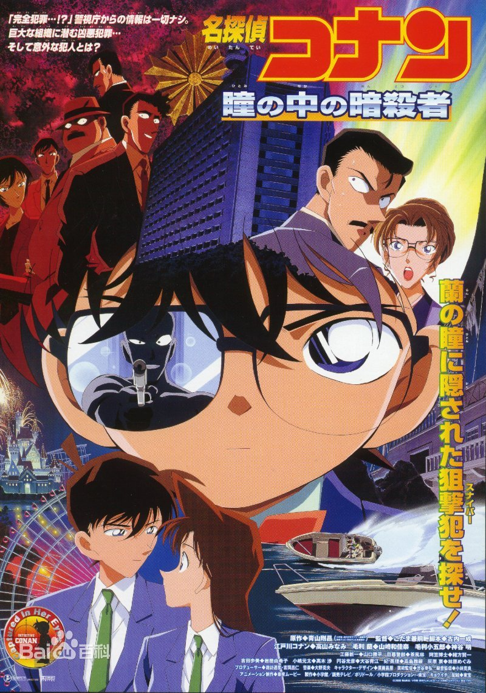
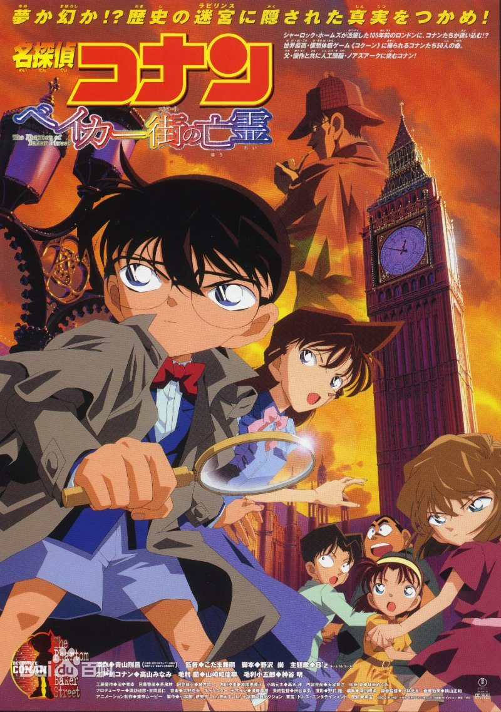

### 二、主页网站编辑

#### 1、index.html [首页]

``` html
<!DOCTYPE html>
<html>
	<head>
		<meta charset="utf-8">
		<title>名探偵コナン | 主题网站</title>
		<link rel="stylesheet" href="css/background.css" />
		<link rel="stylesheet" href="css/lunbo.css" />
		<link rel="stylesheet" href="css/nav.css" />
		<script type="text/javascript" src="js/js.js"></script>

	</head>
	<body>

		<div class="body_box">

			<div class="nav_roof">
				<ul>
					<li class="nav_img"><a href="index.html"></a></li>
					<li><a href="role.html">人物介绍</a></li>
					<li><a href="zt_img.html">主题图片</a></li>
					<li><a href="jcb.html">影剧海报</a></li>
					<li><a href="jq_exp.html">剧情曝光</a></li>
					<li><a href="admin.html">粉丝专属</a></li>
				</ul>
			</div>
			<div id="lunbo_box">
				<div class="lunbo_img">
					
					
					
					
				</div>
			</div>

			<div class="text_box">
				
				<div class="text_font">
					<p>动画名称：名侦探柯南（名探偵コナン）</p>
					<p>改编原著：青山刚昌</p>
					<p>播出时间：1996年——至今</p>
					<p>剧情介绍：
						高中生侦探工藤新一和青梅竹马的同学毛利兰一同去游乐园玩的时候，目击了黑衣男子的可疑交易现场。只顾偷看交易的工藤新一，却忽略了从背后接近的另一名同伙。他被那名男子灌下了毒药，当他醒来时，身体居然缩小了！
						如果让那些家伙知道工藤新一还活着的话，不仅性命难保，还会危及身边的人。在阿笠博士的建议下他决定隐瞒身份，在被小兰问及名字时，化名江户川柯南，为了搜集那些家伙的情报，寄住在父亲以侦探为业的小兰家中。
						谜团重重的黑衣组织……他所了解的，就只有他们是以酒的名称作为代号的。为了揭露那些家伙的真面目，小小侦探江户川柯南的活跃开始了！</p>
				</div>
			</div>
			<div class="back_role foot_right">
				
			</div>
			<div class="video_back">
				<!--  -->
				<video width="100%" autoplay="autoplay" controls  
				 poster="video/back_img.jpg" style="object-fit: fill;">
					<!-- 循环播放、页面预加载时同时播放就绪、一旦就绪立即播放 -->
					<source src="video/back.mp4" type="video/mp4" >	</source>
					<source src="video/back.ogg" type="video/ogg"></source>
					<!-- <source src="video/back.webm" type="video/webm"></source> -->
				</video>
			</div>


		</div>
		<div class="back_foot_left">
			
		</div>
		<div class="foot">
			<p>版权所有&copy;王子 2018210095</p>
		</div>
	</body>
</html>

```

#### 2、background.css
``` css
	*{margin:0px;padding:0px}
	body{background-image:url(../img/background.gif);width:100%;position:relative;z-index:3}
	.body_box{width:100%;height:auto}
	.text_box{background-color:rgba(204,204,204,.6);border-radius:20px;position:relative;top:100px;padding-bottom:34.375rem;left:20%;width:56%;height:auto;padding:2%}
	.back_box{position:relative;width:20%;float:left;margin-right:20px}
	.text_font{}
	.text_font p{font-size:20px;line-height:40px;font-family:"微软雅黑";position:relative;margin:10px 10px}
	.video_back{width:60%;position:relative;left:20%;top:150px}
	.back_foot_left{width:20%;position:fixed;bottom:30px;left:0}
	.back_foot_left img{width:100%}
```


#### 3、role.html [人物介绍]

``` html
<!DOCTYPE html>
<html>
	<head>
		<meta charset="utf-8">
		<title>名探偵コナン | 人物介绍</title>
		<link rel="stylesheet" href="css/nav.css" />
		<link rel="stylesheet" href="css/background_page.css" />
	</head>
	<body>

		<div class="body_box">
			<div class="nav_roof">
				<ul>
					<li class="nav_img"><a href="index.html"></a></li>
					<li><a class="bot" href="role.html">人物介绍</a></li>
					<li><a href="zt_img.html">主题图片</a></li>
					<li><a href="jcb.html">影剧海报</a></li>
					<li><a href="jq_exp.html">剧情曝光</a></li>
					<li><a href="admin.html">粉丝专属</a></li>
				</ul>
			</div>

			<div class="box_img_nav">
				
			</div>
			<div class="text_h">
				<h1>人物介绍</h1>
			</div>
			<div class="img_box_right">
				<!-- 居右的纵向排放的横图 -->
				
				
				
				
				
				
				<!--  -->
				
				
				
				
				
				<!--  -->
				
				
			</div>
			<div class="role_box">
				<div class="role_js">
					
					<div class="role_text">
						<p>姓名：江户川 柯南</p>
						<p>性别：男</p>
						<p>外表看似小孩，其真实身份是高中生侦探——工藤新一。
							和青梅竹马的同学毛利兰一起去游乐园玩，目击到黑衣男子的可疑交易现场，被灌下开发中的药物，
							变成了小学生的身体。那天以后，为了隐藏真实身份，化名江户川柯南，在青梅竹马的毛利兰家寄住的同时，日复一日解决了许多案件。一切都是为了恢复自己的身体。</p>
					</div>
				</div>

				<div class="role_js">
					
					<div class="role_text">
						<p>姓名：工藤 新一</p>
						<p>性别：男</p>
						<p>崇拜夏洛克·福尔摩斯的高中生侦探。5月4日出生，17岁。帝丹高中2年级B班。还是高中1年级学生的时候，在去往洛杉矶的飞机上解决了杀人案，
							在那里和目暮警官等人相识。此后，作为高中生侦探活跃起来。特长是足球，头脑清醒出众。</p>
					</div>
				</div>
				<div class="role_js">
					
					<div class="role_text">
						<p>姓名：毛利 兰</p>
						<p>性别：女</p>
						<p>新一的青梅竹马，帝丹高中2年级B班，空手道部女主将，都大会中有头号实力的文武双全的女生。一直喜欢着新一，在他突然消失后等待着他的归来。有时柯南的名推理会与新一的身影重叠，她开始像母亲一般
							温柔地照顾着柯南和少年侦探团。此外，和铃木园子是青梅竹马的挚友，从以前开始便无话不谈。</p>
					</div>
				</div>

				<div class="role_js">
					
					<div class="role_text">
						<p>姓名：毛利 小五郎</p>
						<p>性别：男</p>
						<p>小兰的父亲，前警视厅搜查一课刑警，与目暮警部是故交。现在在毛利侦探事务所营业，多亏了柯南的名推理，以“沉睡的小五郎”闻名。经过小兰的拼命努力，
							经常与分居中的妻子——妃英理见面，有好色的一面妨碍着，很难坦率地重修旧好。</p>
					</div>
				</div>
					<!-- role_js 内容多次复制即可，每一个role_js代表一个人物-->
			</div>
		</div>
		<div class="back_foot_left">
			
		</div>
		<div class="foot">
			<p>版权所有&copy;王子 2018210095</p>
		</div>
	</body>
</html>

	
```

#### 4、backgroundpage.css 
``` css
	*{margin:0;padding:0}
	body{background:url(../img/background.gif);width:100%;position:relative;z-index:999}
	.body_box{width:100%;position:relative;z-index:44;height:auto}
	.box_img_nav img{position:relative;left:20%;top:60px;width:60%}
	.text_h{position:relative;left:30%;top:60px;width:40%;height:60px;background:rgba(204,204,204,.7);border-radius:30px;z-index:2;text-align:center;line-height:60px}
	.role_box{width:60%;position:relative;left:20%;height:auto}
	.role_js{position:relative;top:60px;float:left;width:520px;margin:15px;padding:10px;background:rgba(204,204,204,.7);border-radius:10px}
	.role_js img{width:30%;height:250px;float:left}
	.role_text p{margin-bottom:15px;margin-right:5px;font-size:15px;line-height:20px}
	.role_text{position:relative;left:15px;margin:10px}
	.img_box_right{width:18%;float:right;position:absolute;top:420px;right:0.625rem;height:1000px}
	.img_box_right img{width:100%;margin-bottom:50px}
	.back_foot_left{position:fixed;left:0;bottom:0;width:18%}
	.back_foot_left img{width:100%}
```

#### 5、jcb.html [影剧海报]
``` html
	<!DOCTYPE html>
	<html>
		<head>
			<meta charset="utf-8">
			<title>名探偵コナン | 剧场剧情</title>
			<link rel="stylesheet" href="css/nav.css"/>
			<link rel="stylesheet" href="css/background_jcb.css"/>
		</head>
		<body>
			<div class="back_box">
				<div class="nav_roof">
					<ul>
						<li class="nav_img"><a href="index.html"></a></li>
						<li><a href="role.html">人物介绍</a></li>
						<li><a href="zt_img.html">主题图片</a></li>
						<li><a class="bot"  href="jcb.html">影剧海报</a></li>
						<li><a href="jq_exp.html">剧情曝光</a></li>
						<li><a href="admin.html">粉丝专属</a></li>
					</ul>
				</div>
				<div class="img_box">
					<h1>《名侦探柯南》剧场版海报</h1>
				</div>
				<div class="img_H">
					<div id="img_H_start">
						<ul>
							<li></li>
							<li></li>
							<li></li>
							<li></li>
							<li></li>
							<li></li>
							<li></li>
							<li></li>
							<li></li>
							<li></li>
							<li></li>
							<li></li>
							<li></li>
							<li></li>
							<li></li>
							<li></li>
							<li></li>
							<li></li>
							<li></li>
							<li></li>
							<li></li>
							<li></li>
							<li></li>
						</ul>
						<a href="javascript:;" style="left:10px;">
							<</a> <a href="javascript:;" style="right:10px;">>
						</a>
					</div>
				</div>
			
			</div>
			<div class="foot">
				<p>版权所有&copy;王子 2018210095</p>
			</div>
			
		</body>
		<script type="text/javascript">
			window.onload = function() {
				var oDiv = document.getElementById('img_H_start');
				var oUl = oDiv.getElementsByTagName('ul')[0];
				var aLi = oUl.getElementsByTagName('li');
				var aA = oDiv.getElementsByTagName('a');
				var iSpeed = 1; //正左负右
				var timer = null;
				//计算ul的宽为所有li的宽的和;
				oUl.innerHTML += oUl.innerHTML + oUl.innerHTML;
				oUl.style.width = aLi[0].offsetWidth * aLi.length + 'px';
		
				function Slider() {
					if (oUl.offsetLeft < -oUl.offsetWidth / 2) {
						oUl.style.left = 0;
					} else if (oUl.offsetLeft > 0) {
						oUl.style.left = -oUl.offsetWidth / 2 + 'px';
					}
					oUl.style.left = oUl.offsetLeft - iSpeed + 'px'; //正负为方向
				}
				timer = setInterval(Slider, 30);
				aA[0].onclick = function() {
					iSpeed = 1; //控制速度的正负
				}
				aA[1].onclick = function() {
					iSpeed = -1;
				}
				oDiv.onmouseover = function() {
					clearInterval(timer);
				}
				oDiv.onmouseout = function() {
					timer = setInterval(Slider, 30);
				}
			};
		</script>
	</html>
	
```

#### 6、background_jcb.css
``` css
	*{margin:0px;padding:0px}
	body{background-image:url(../img/background.gif);width:100%;position:relative;z-index:3}
	.body_box{position:relative;width:100%;height:auto;margin-bottom:200px}
	.img_box{width:60%;position:relative;left:20%;top:80px;height:100px;color:#FFFFFF}
	.img_box h1{padding-bottom:50px;text-align:center;padding-top:50px}
	.img_H{position:relative;top:100px;width:100%;height:500px;margin-bottom:100px}
	div,img{}
	.img_H img{float:left;height:600px;width:auto;margin-right:10px}
	#img_H_start{position:relative;width:auto;margin:20px auto;height:1000px
		overflow:hidden}
	#img_H_start ul{position:absolute;left:0}
	#img_H_start a{position:absolute;z-index:2;text-decoration:none;top:45%;display:none}
	#img_H_start ul li{padding:5px;list-style:none;width:400px;height:auto;float:left}
	#img_H_start ul li img{width:100%;height:100%}
```

#### 7、jq_exp.html [剧情曝光]
``` html
	<!DOCTYPE html>
	<html>
		<head>
			<meta charset="utf-8">
			<title>名探偵コナン | 剧情曝光</title>
			<link rel="stylesheet" href="css/background_jq.css" />
			<link rel="stylesheet" href="css/lunbo.css" />
			<link rel="stylesheet" href="css/nav.css" />
			<!-- <script type="text/javascript" src="js/js.js"></script> -->
		</head>
		<body>
			<div class="back_box">
				<div class="nav_roof">
					<ul>
						<li class="nav_img"><a href="index.html"></a></li>
						<li><a href="role.html">人物介绍</a></li>
						<li><a href="zt_img.html">主题图片</a></li>
						<li><a href="jcb.html">影剧海报</a></li>
						<li><a class="bot" href="jq_exp.html">剧情曝光</a></li>
						<li><a href="admin.html">粉丝专属</a></li>
					</ul>
				</div>
				<div class="box_img_nav">
					
				</div>
				<!-- text_box是一个帖子的box容器，包含标题title 内容content 笔注foot -->
				<div class="text_box">
					<div class="text_title">
						名侦探柯南幕后Boss曝光
					</div>
					<div class="text_content">
						<p>柯南作者：青山刚昌，在网络社交平台提前揭露新一章的漫画内容，该内容是“新一”在休学旅行途中，破解了旅途城市的一桩密案，在破案中途
						被电视台记者不慎拍到了新一的脸，此时被怀疑是黑衣组织“朗姆”的三位从电视中也看见了新一出现的画面！</p>
						
						<p>回到日本以后的柯南，由于自己休学旅行的新闻被记者包围在阿笠博士的家中；工藤优作和工藤美希子找到第一个在网上发帖称：“见到工藤新一”的网友并祝福之删帖，至此风波结束</p>
						<p>工藤优作告诉了柯南，自己怀疑的真正的幕后大Boss是“乌丸莲耶”！作者公布了“那位大人”（Boss）的作画内容</p>
						
						
						<p>在此之前，青山也多次表示boss早就出现过了，引来的粉丝“破解”，但是没有人怀疑到“乌丸莲耶”的身上！乌丸莲耶出现的剧情是“单行册第30册”</p>
					</div>
					<div class="text_foot">
						By:admin | Time:2019-12-24
						
						<hr />
					</div>
				</div>
				<div class="text_box">
					<div class="text_title">
						新兰党的开心福利
					</div>
					<div class="text_content">
						<p>休学旅行后新一和小兰终于在一起，是真正的恋人！</p>
						
						
						
					</div>
					<div class="text_foot">
						By:admin | Time:2019-12-24
						<hr />
					</div>
				</div>
				
				<!-- text_box 就是一个文字的整体，title是标题；content是主题内容 -->
				
				<!-- 居左的文字索引导航 -->
				<div class="back_left">
					<div class="title_box">
						<h4>文章索引目录</h4>
						<ul class="title_index">
							<li><a href="#">名侦探柯南幕后Boss曝光</a></li>
							<li><a href="#">新兰党的开心福利</a></li>
						</ul>
					</div>
				</div>
				
				<div class="back_foot">
					
				</div>
			</div>
			<div class="foot">
				<p>版权所有&copy;王子 2018210095</p>
			</div>
		</body>
		<script src="js/jquery-3.4.1.min.js"></script>
		<script>
			$(document(){
				var str = $('.text_title').text();
				
				$('body')
			});
		</script>
	</html>
	
```

#### 8、background_jq.css 
``` css
	*{margin:0px;padding:0px}
	body{background-image:url(../img/background.gif);width:100%;position:relative;z-index:3}
	.body_box{width:100%;height:auto}
	.box_img_nav img{position:relative;left:20%;top:60px;width:60%;padding-bottom:60px}
	.text_title{position:relative;left:20%;top:10px;padding-bottom:10px;width:60%;height:3.75rem;background-color:rgba(204,204,204,.7);border-radius:60px;font-size:30px;line-height:3.75rem;text-align:center;letter-spacing:5px;font-weight:bold}
	.text_content{width:60%;height:auto;padding-top:20px;padding-bottom:20px;border-radius:20px;margin-bottom:30px;position:relative;left:20%;top:20px;background-color:rgba(204,204,204,.7)}
	.text_content p{padding:0px 20px;font-size:20px;line-height:35px;text-indent:40px}
	.text_content img{width:80%;height:auto;padding:10px 0;position:relative;left:10%}
	.text_foot{width:60%;position:relative;left:20%;text-align:right;color:#ffffff;padding-right:20px;margin-bottom:50px}
	.back_left{position:fixed;top:20%;left:10px;width:15%;background-color:rgba(204,204,204,.7);padding:10px;border-radius:10px}
	.back_left a{text-decoration:none}
	.back_left li{list-style:none;margin:10px 5px 10px 20px}
	.back_foot{position:fixed;bottom:20px;right:0;z-index:99}
```

#### 9、zt_img.html [主题图片]
``` html
<!DOCTYPE html>
<html>
	<head>
		<meta charset="utf-8">
		<title>名探偵コナン | 主题图片</title>
		<link rel="stylesheet" href="css/nav.css"/>
		<link rel="stylesheet" href="css/background_zt.css"/>
	</head>
	<body>
		<div class="back_box">
			<div class="nav_roof">
				<ul>
					<li class="nav_img"><a href="index.html"></a></li>
					<li><a href="role.html">人物介绍</a></li>
					<li><a  class="bot" href="zt_img.html">主题图片</a></li>
					<li><a href="jcb.html">影剧海报</a></li>
					<li><a href="jq_exp.html">剧情曝光</a></li>
					<li><a href="admin.html">用户模板</a></li>
				</ul>
			</div>
			<div class="img_box_right"><!-- 居右的纵向排放的横图 -->
				
				
				
				
				
				
				
				
				
				
				
				
				
				
				
				
				
				
				
				
				
				
				
				
				
				
				
				
				
				
				
				
				
				
				
			</div>
			<div class="back_foot_left">
				
			</div>
			<div class="img_box"><!-- 居中的一横四纵 -->
				<div class="img_W"><!-- 横向的大图 -->
					<!-- 无浮动 -->
					
				</div>

				<div class="img_H_l"><!-- 纵向的大图 -->
					<!-- 浮动 -->
					
				</div>
				<div class="img_H_r"><!-- 纵向的大图 -->
					<!-- 浮动 -->
					
				</div>

				<div class="img_H_l"><!-- 纵向的大图 -->
					<!-- 浮动 -->
					
				</div>
				<div class="img_H_r"><!-- 纵向的大图 -->
					<!-- 浮动 -->
					
				</div>
				<div class="img_W"><!-- 横向的大图 -->
					<!-- 无浮动 -->
					
				</div>
				<div class="img_H_l"><!-- 纵向的大图 -->
					<!-- 浮动 -->
					
				</div>
				<div class="img_H_r"><!-- 纵向的大图 -->
					<!-- 浮动 -->
					
				</div>

				<div class="img_H_l"><!-- 纵向的大图 -->
					<!-- 浮动 -->
					
				</div>
				<div class="img_H_r"><!-- 纵向的大图 -->
					<!-- 浮动 -->
					
				</div>
				<!-- ………………………… -->
				<!-- img_W 是一个横向的大图 img_h_r/img_h_l是竖向的小图，这里采用的是一横四小竖的排列规律 -->
			</div>
			

			<div class="back_foot">
				
			</div>
		</div>
		<div class="foot">
			<p>版权所有&copy;王子 2018210095</p>
		</div>
	</body>
</html>

```

#### 10、background_zt.css 
``` css
	*{margin:0px;padding:0px}
	body{background-image:url(../img/background.gif);width:100%;position:relative;z-index:3}
	.body_box{width:100%;height:auto}
	.img_box{clear:both;width:60%;background-color:#FFFFFF;position:relative;left:20%;top:80px;height:100px}
	.img_W{clear:both;margin-bottom:20px;position:relative;width:100%}
	.img_box img{width:100%}
	.img_H_l{clear:both;float:left;width:45%;margin-bottom:50px}
	.img_H_r{float:right;width:45%}
	.back_foot{width:20%;position:fixed;bottom:-10px;left:0}
	.back_foot img{width:100%}
	.back_foot_left{width:18%;position:fixed;left:10px;top:80px}
	.back_foot_left img{width:100%}
	.img_box_right{width:18%;float:right;position:absolute;top:80px;right:0.625rem;height:1000px}
	.img_box_right img{width:100%;margin-bottom:50px}
```

#### 11、admin.html [粉丝专属]

``` html

<!DOCTYPE html>
<html>
	<head>
		<meta charset="utf-8">
		<title>名探偵コナン | 粉丝专属</title>
		<link rel="stylesheet" href="css/background_admin.css" />
		<!-- <link rel="stylesheet" href="css/lunbo.css" /> -->
		<link rel="stylesheet" href="css/nav.css" />
		<script type="text/javascript" src="js/js.js"></script>
		<style type="text/css">

		</style>
	</head>
	<body>
		<div class="body_box">
			<div class="nav_roof">
				<ul>
					<li class="nav_img"><a href="index.html"></a></li>
					<li><a href="role.html">人物介绍</a></li>
					<li><a href="zt_img.html">主题图片</a></li>
					<li><a href="jcb.html">影剧海报</a></li>
					<li><a href="jq_exp.html">剧情曝光</a></li>
					<li><a class="bot" href="admin.html">粉丝专属</a></li>
				</ul>
			</div>
		</div>
		<div class="img_log">
			
		</div>

		<div class="login_box" οnlοad="javascript:focusOnUsername();">
			<h2>粉 丝 账 号 登 录</h2>
			<div class="input_text">
				<h4>用户名</h4>
				<input type="text" id="user" class="input" />
			</div>
			<div class="clear"></div>
			<div class="input_text">
				<h4>口令牌</h4>
				<input type="password" id="pass" class="input" />
			</div>
			<div class="input_text input_button">
				<input type="button" value="登录" />
				<input type="reset" />
			</div>
			<div class="clear"></div>
		</div>
		<div class="back_foot_left">
			
		</div>
		<div class="back_foot_cen">
			
		</div>
		
		<div class="back_foot_right">
			
		</div>

		<div class="foot_admin">
			<p>版权所有&copy;王子 2018210095</p>
		</div>

	</body>
</html>

```

#### 12、background_admin.css

``` css
*{margin:0px;padding:0px;}
body{/* 设置背景图片 */
background-image:url(../img/background.gif);/*opacity:0.9;*/
width:100%;position:relative;z-index:3;/* height:68.75rem;*/
}
.body_box{/* position:relative;*/
width:100%;/* background-color:aqua;*/
/* z-index:44;*/
height:auto;}
.login_box{width:50%;height:auto;background:url(../img/gif/gif_6.gif) no-repeat;background-size:cover;/* 实现居中效果 */
position:fixed;top:20%;left:25%;text-align:center;}
.login_box img{width:100%;height:100%;}
.login_box h2{margin-bottom:40px;margin-top:50px;letter-spacing:5px;color:#FFFF00;}
.login_box .k1{margin-right:150px;}
.login_box h4{/* float:left;*/
margin-bottom:20px;color:#00ff00;letter-spacing:10px;}
.clear{clear:both;}
.input_text{margin-top:30px;}
.input_text input{border:1px solid #00FFFF;background:rgba(255,255,255,.6);height:30px;width:50%;padding:2px 10px 2px 10px;color:#000000;}
.input_text input:hover{background:#FAEBD7;}
.input_button{margin-bottom:50px;}
.input_button input{background:#00FFFF;color:#8A2BE2;cursor:pointer;margin-bottom:5px;font-size:15px;letter-spacing:5px;}
.input_button input:hover{font-weight:bold;color:red;font-size:18px;letter-spacing:10px;}
.img_log{position:relative;top:190px;left:25%;z-index:1;}
.back_foot_left{width:20%;position:fixed;bottom:50px;}
.back_foot_left img{width:100%;}
.back_foot_right{width:20%;position:fixed;bottom:50px;right:50px;}
.back_foot_right img{width:100%;}
.back_foot_cen{width:20%;position:fixed;bottom:40px;left:40%;}
.back_foot_cen img{width:100%;}

```

#### 13、lunbo.css [轮播图片样式]

``` css
.lunbo_img {
	width: 100% ;
	height: 100%;
	margin: 0 auto;
	scrollbar-face-color: #000;
}
.lunbo_img img {
	width: 100%;
	height: 100%;
	margin: 0 auto;
	padding-top: 60px;
}

.lunbo_img .img1 {
	display: block;
}

.lunbo_img .img2 {
	display: none;
}

.lunbo_img .img3 {
	display: none;
}
#lunbo_box{
	width: 60%;
	height: 480px;
	/* position: absolute; */
	position: relative;
	left: 20%;
	background-color: #000000;
}
```

#### 14、nva.css [导航条、页脚样式]

``` css
.nav_roof{padding:0px;margin:0px;background-color:#000000;position:fixed;/*left:20%;*/
z-index:1;height:60px;text-align:center;/* align-content:center;*/
width:100%;}
.nav_roof li:hover{font-weight:bold;color:#00FFFF;}
.bot{border-bottom:4px solid #FFFFFF;padding-bottom:15px;font-weight:bold;}
.nav_roof .nav_img{margin-right:100px;}
.nav_roof ul{position:fixed;z-index:1;left:20%;background-color:#000000;}
.nav_roof li{list-style:none;font-size:20px;line-height:60px;float:left;width:100px;height:40px;margin-right:30px;margin-bottom:1.25rem;background-color:#000000;}
.nav_roof a{color:#fff;text-decoration:none;}
.foot{/* 页脚设置和定位 */
clear:both;width:100%;height:50px;background:#000000;position:relative;/* left:0rem;*/
/* bottom:0;*/
top:200px;z-index:10;overflow:hidden;color:#FFFFFF;text-align:center;}
.foot p{margin-top:10px;}
.back_role{float:right;position:fixed;bottom:50px;right:0;z-index:1;}
.back_role img{width:90%;}
.foot_admin{clear:both;width:100%;height:50px;background:#000000;position:fixed;/* left:0rem;*/
/* bottom:0;*/
bottom:0;z-index:10;overflow:hidden;color:#FFFFFF;text-align:center;}
.foot_admin p{margin-top:10px;}

```

